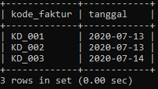
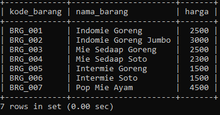
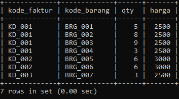
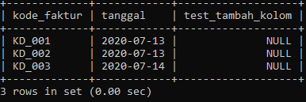
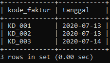
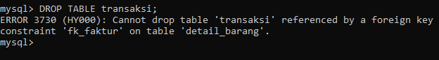
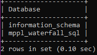
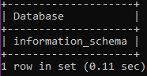

# Implementasi Query SQL

## Membuat Database
Database yang akan saya buat memiliki nama **mppl_waterfall_sql**.<br>
Query :
```
mysql> CREATE DATABASE mppl_waterfall_sql;
```

## Membuat User Baru
User baru yang akan saya buat memiliki *username* = **bayu**, dan *password* = **qwerty**.<br>
Query :
```
mysql> CREATE USER ‘bayu’@’localhost’ IDENTIFIED BY ‘qwerty’;
```

## Memberikan Hak Akses untuk Database ke User
User **bayu** akan diberikan hak akses penuh untuk database **mppl_waterfall_sql**.<br>
Query :
```
mysql> GRANT ALL PRIVILEGES ON mppl_waterfall_sql.* TO ‘bayu’@’localhost’;
```

## Masuk menggunakan User Baru dan menggunakan database
Query :
```
mysql -u bayu -p
mysql> USE mppl_waterfall_sql;
Database changed
```

## Membuat tabel sesuai ER Diagram yang telah dibuat
Query :
```
mysql> CREATE TABLE barang (kode_barang VARCHAR(7) PRIMARY KEY, nama_barang TEXT, harga INT);
mysql> CREATE TABLE transaksi (kode_faktur VARCHAR(6) PRIMARY KEY, tanggal DATE);
mysql> CREATE TABLE barang (kode_faktur VARCHAR(6), kode_barang VARCHAR(7), qty INT, harga INT, CONSTRAINT fk_faktur FOREIGN KEY (kode_faktur) REFERENCES transaksi(kode_faktur), CONSTRAINT fk_barang FOREIGN KEY (kode_barang) REFERENCES barang(kode_barang));
```

## Memasukkan data ke setiap tabel

### Tabel barang

Query :
```
mysql> INSERT INTO barang (kode_barang, nama_barang, harga) VALUES ('BRG_001', 'Indomie Goreng', 2500);
```
dst.

### Tabel transaksi
Query :
```
mysql> INSERT INTO transaksi (kode_faktur, tanggal) VALUES ('KD_001', '2020-07-13');
```
dst.

### Tabel detail_barang
Query :
```
mysql> INSERT INTO detail_barang (kode_faktur, kode_barang, qty, harga) VALUES ('KD_001', 'BRG_001', 5, 2500);
```
dst.

## Melihat data dari setiap tabel
Query :
```
mysql> SELECT * FROM transaksi;
```

> Untuk melihat data dari tabel yang lain, cukup mengganti nama tabel yang ada di query di atas.
Output :
### Tabel transaksi


### Tabel barang


### Tabel detail_barang


## Menambah dan menghapus kolom pada sebuah tabel

### Menambah kolom
Query :
```
mysql> ALTER TABLE transaksi ADD test_tambah_kolom INT;
```

> Gunakan query **SELECT** untuk melihat tabelnya.

Output :


### Menghapus kolom
Query :
```
mysql> ALTER TABLE transaksi DROP COLUMN test_tambah_kolom;
```
Output :


## Mencoba menghapus tabel yang memiliki *Constraint Foreign Key* di tabel lain
Query :
```
mysql> DROP TABLE transaksi;
```

Output :


## Menghapus Database
Query :
```
mysql> DROP DATABASE mppl_waterfall_sql;
```

> Sebelum menghapus database, kita lihat terlebih dahulu daftar database yang ada, dengan **Query : SHOW DATABASES;**

Output (sebelum menghapus database) :


Output (setelah menghapus database) :
